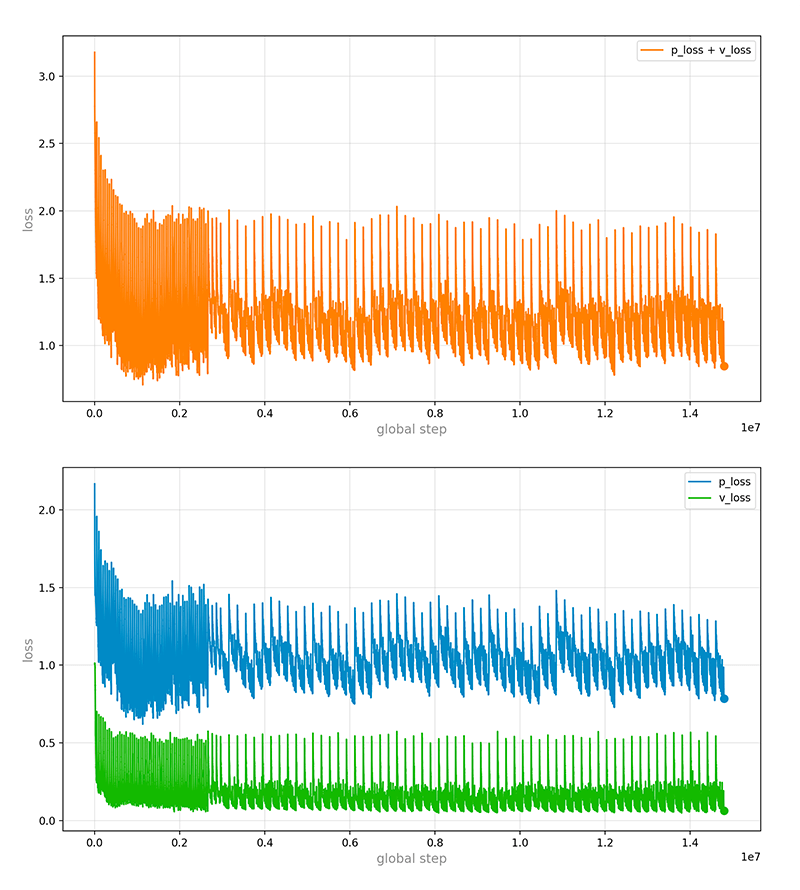

# othello-zero

## About

**othello-zero** is an implementation of the AlphaGo Zero and the AlphaZero algorithm for othello playing. The main idea comes from these papers by DeepMind:

* Core algorithm: [Mastering the Game of Go without Human Knowledge](https://www.nature.com/articles/nature24270)
* Details of implementation: [Mastering Chess and Shogi by Self-Play with a General Reinforcement Learning Algorithm](https://arxiv.org/abs/1712.01815)

I also referred some great posts:

* Monte Carlo Tree Search: [A Deep Dive into Monte Carlo Tree Search](http://www.moderndescartes.com/essays/deep_dive_mcts/)
* Bit Board: [リバーシプログラム - bitboard による合法手生成](http://d.hatena.ne.jp/ainame/20100426/1272236395)

## Thanks

[icodeface](https://github.com/icodeface): Resolved a issue of compiling Edax, and sponsor this project generously.

## Environment

* python 3.5 64-bit
* tensorflow or tensorflow-gpu 1.11

## Usage

You can use `-h` option for more help.

```
python othello.py -h
```

### Learning loop

A learning loop comes in two parts: `self_play` and `train`. `self_play` generates newest games by using the latest neural network model. `train` generates the next generation of model by solely learning newest games.

```
python othello.py --learning-loop
```

I'm using a sigle PC packing a 1080Ti GPU, a 4-Core i7 CPU and 32G memory to run this project. Here are my config in `config.py`:

```
# learning config
self_play_wokers_num = 8
self_play_woker_gpu_memory_fraction = 0.04
self_play_batch_size = 128
self_play_echo_max = 2
train_batch_size = 128
train_echo_max = 50
learning_loop_echo_max = 6
```

>On my computer, two `self_play` echos cost about a hours to generate 2048(2×8×128) games. These wokers occupy ~17.6G(8×2.2G) memory. Then `train` costs ~12 minutes to take ~50K steps. Whole loop costs about 72 minutes to produce new version of **othello-zero**.

### Play with Edax

Edax is one of the strongest othello programs in the world, written by [abulmo](https://github.com/abulmo). It was trained with about 800K games, both various in the opening and of high quality in the endgame.

Paweł Liskowski wrote a paper called [Learning to Play Othello with Deep Neural
Networks](https://arxiv.org/pdf/1711.06583.pdf). He trained several CNN architectures to challenge Edax. This is a good reference on how powerful Edax is.

Edax is not a part of this project. You need go [HERE](https://github.com/2Bear/edax-reversi), click **Clone or download** button, download the source and build it. Don't download release version 4.4. It dosen't work.

```
cd edax/project/path
mkdir -p bin

cd src
make build ARCH=x64 COMP=your-compiler OS=your-os
```

Then go [HERE](https://github.com/abulmo/edax-reversi/releases), download **eval.7z**, unzip to the directory where the Edax executable is. Next, copy them all to **edax** folder in this project.

```
├── ...
├── log
│   ├── ...
│   └── ...
├── edax
│   ├── data
│   │   └── eval.dat
│   └── Edax
├── othello.py
├── tree.py
├── ...
```

OK

```
python othello.py --play-with-edax
```

### Play with human

You can play with **othello-zero** on the command line.

```
python othello.py --play-with-human
```

Then

```
=================
  A B C D E F G H
1 ┌─┬─┬─┬─┬─┬─┬─┐
2 ├─┼─┼─┼─┼─┼─┼─┤
3 ├─┼─┼─┼─┼─┼─┼─┤
4 ├─┼─┼─○─●─×─┼─┤
5 ├─┼─┼─●─●─●─┼─┤
6 ├─┼─┼─×─┼─×─┼─┤
7 ├─┼─┼─┼─┼─┼─┼─┤
8 └─┴─┴─┴─┴─┴─┴─┘

●black plays F5.
it's ○white turn.
>
```

Just type your move, such as F4, and press `Enter`.

## Milestone

| Date | othello-zero version | Achievement |
| --- | --- | --- |
| 2018-11-28 | V1 -> V6 | None |
| 2018-11-29 | V7 -> V12 | V10 defeated me :-) |
| 2018-11-30 | V13 -> V18 | V14 defeated Edax Lv.1 |
| 2018-12-01 | V19 -> V24 | None |
| 2018-12-02 | V25 -> V30 | V26 defeated Edax Lv.2 |
| 2018-12-03 | ~~V31 -> V36~~ | Abandon |
| 2018-12-04 | V31 -> V36 | None |
| 2018-12-05 | V37 -> V42 | None |
| 2018-12-06 | V43 -> V48 | V43 defeated Edax Lv.3 |
| 2018-12-07 | V49 -> V54 | None |
| 2018-12-08 | V55 -> V57 | None |
| 2018-12-09 | V58 -> V63 | None |
| 2018-12-10 | V64 -> V69 | V67 defeated Edax Lv.4 |
| 2018-12-11 | V70 -> V78 | None |
| 2018-12-12 | V79 -> V87 | None |
| 2018-12-13 | V88 -> V96 | None |
| 2018-12-14 | V97 -> V105 | None |
| 2018-12-15 | V106 -> V114 | None |
| 2018-12-16 | V115 -> V117 | Suspended |

2018-12-03: `train_echo_max` was changed from 50 to 100, but I'm not satisfied with the result, so then undid this change the next day.

2018-12-08: `self_play_echo_max` was changed from 2 to 4.

2018-12-09: `train_echo_max` was changed from 50 to 100.

2018-12-16: **othello-zero** is close to Edax Lv.5, but hard to defeat it. I suspend this project.

## Data

On the [releases page](https://github.com/2Bear/othello-zero/releases) you can download:

* All key checkpoints, such as V1, V10, V20 and so on.

* Whole loss-log file includes policy-loss and value-loss.



## checkpoint File

The **checkpoint** file is just a bookmark file. You can create it manually.

Create a new text file named **checkpoint**. Edit it. Here is a example, just one line:
```
model_checkpoint_path: "v117-14797350"
```
You can replace `v117-14797350` with any checkpoint name such as `v001-49150`.

In this way, you can choose different checkpoints to restore, and compare them.

## Comparison

|  | AlphaGo Zero | AlphaZero | othello-zero |
| :-- | :-- | :-- | :-- |
| ResNet blocks | 20 or 40 | 20 | 10 |
| History features | 8 | 8 | 4 |
| Dirichlet noise α | 0.03 | Chess 0.3</br>Shogi 0.15</br>Go 0.03 | 0.5 |
| Learning rate | -->400K 10^-2</br> -->600K 10^-3</br> 600K--> 10^-4 | -->400K 10^-2</br> -->600K 10^-3</br> 600K--> 10^-4 | 10^-2 |
| Transform the board position during MCTS | Yes | No | No |
| Virtual loss | Yes | Yes | No |
| Model that generates new games | The best | The latest | The latest |
| The replacement of old games for training | Smooth | Smooth | Complete |

---

**Presented by doBell. We are so proud of this.**</br>
**来自 doBell 团队，我们为此倍感荣光。**
